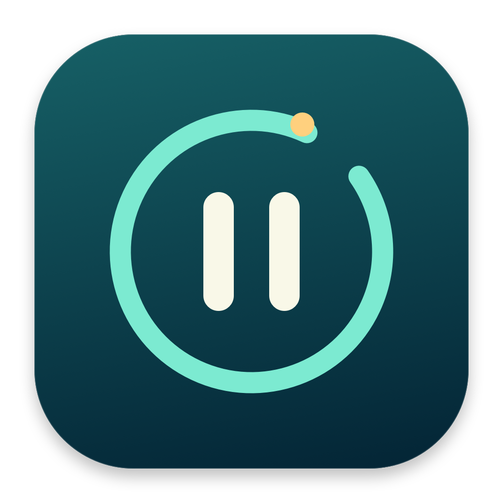

<p align="center"></p>

# 歇一刻 · XieYiKe

**忙的时候记得歇，晚的时候记得停。**

一个轻巧的 macOS 透明悬浮倒计时。给上班、学习和晚间的屏幕时间设个终点，到时在每台显示器中央显示你写下的提醒。

[下载最新版本](https://github.com/wizardlouis/XieYiKe/releases/latest) · [安装说明](docs/INSTALL.txt) · [问题反馈](https://github.com/wizardlouis/XieYiKe/issues)

## 用它提醒自己

- 工作时：“站起来，看看窗外。”
- 学习时：“这一段结束了，歇一刻。”
- 夜里：“今天到这里，准备休息。”

提醒文字、字体大小和颜色由你决定。这些只是使用示例，应用不包含自动执行的健康计划。

## 功能

- **透明置顶**：倒计时悬浮在桌面顶部，可拖动位置，可跨桌面和全屏空间显示。
- **时、分、秒设置**：总时长不足一小时显示 `分:秒`；一小时及以上显示 `时:分:秒`，小时位数自动扩展。
- **图标控制**：开始／暂停共用一个按钮，另有重置、设置和锁定。
- **锁定与点击穿透**：锁定后只保留解锁按钮，计时继续，数字区域不挡鼠标操作。
- **所有显示器提醒**：到时在每个显示器中央显示文字，关闭任意一个提醒即可全部收起。
- **菜单栏常驻**：原生闹钟图标，支持控制计时、打开设置、查看版本和退出。
- **本地保存**：时长、提醒文字、字号和颜色会自动保存；不联网、不注册账号、不收集使用数据。

## 下载和安装

要求 **macOS 12 Monterey 或更新版本**。Universal 安装包同时包含 Apple 芯片和 Intel 版本。实际交互已在 Apple 芯片的 macOS 26.2 上验证；不代表所有旧版系统或 Intel 实机都已完成测试。

1. 在 [Releases](https://github.com/wizardlouis/XieYiKe/releases/latest) 下载 `XieYiKe-1.0.2-macOS-universal.dmg`。
2. 打开安装包，将“歇一刻”拖到 Applications 文件夹，再从“应用程序”打开。
3. 应用默认不显示 Dock 图标，请在屏幕顶部菜单栏寻找闹钟图标。

**签名状态：v1.0.2 仅使用 ad-hoc 本地签名，未使用 Apple Developer ID 签名，也未经过 Apple 公证。** 首次打开可能被 macOS 拦截。仅当你确认下载来自本仓库并信任该应用时，按 [Apple 官方说明](https://support.apple.com/102445) 在“系统设置 → 隐私与安全性”中查看“仍要打开”。无需关闭 Gatekeeper 或系统安全保护；受管理的电脑可能不允许用户放行。

ZIP 包提供同一应用的压缩版本；`SHA256SUMS.txt` 提供下载校验值。

## 使用

- 点击播放图标开始，运行时同一按钮变为暂停图标。
- 点击回转箭头停止并恢复设定时长。
- 点击齿轮设置时长、提醒文字、字号和颜色，“预览提醒”可提前检查效果。
- 保存新时长会重置计时；仅修改提醒样式不会打断计时。
- 点击锁图标固定界面，点击剩下的小锁即可解锁。菜单栏也可解锁。
- 每次重新打开应用时，恢复设定时长并等待手动启动。

应用按系统时间计算截止时刻，电脑睡眠后唤醒会补发已到时的提醒；**不会唤醒睡眠中的电脑**。手动调整系统时钟会影响倒计时。锁屏等系统安全界面不能被覆盖。

首版是 **Mac 上的文字提醒工具**，不播放闹铃声音，不自动循环，不强制休息，不锁屏，也没有 iPhone／Android 客户端或手机使用时长检测功能。菜单栏空间不足时，图标可能被刘海或其他图标挤出可见区域。

## 从源码构建

需要 macOS 和 Xcode Command Line Tools，无需第三方依赖。

```sh
xcode-select --install
git clone https://github.com/wizardlouis/XieYiKe.git
cd XieYiKe
./scripts/test.sh
./scripts/build.sh
open dist/歇一刻.app
```

构建生成包含 `arm64` 和 `x86_64` 的 Universal 应用，最低部署目标为 macOS 12。`scripts/package.sh` 运行测试、构建并生成 DMG、ZIP 和 SHA-256 校验文件。图标可通过 `scripts/generate-icon.sh` 从仓库中的原创矢量绘图代码重新生成。

如有 Developer ID 证书，可设置 `SIGNING_IDENTITY` 使用发行签名；签名本身不等于公证，后续还需按 Apple 流程提交公证并附加票据。参见 [维护者发布说明](docs/RELEASING.md)。

## 许可证

[MIT](LICENSE) · Copyright © 2026 wizardlouis
